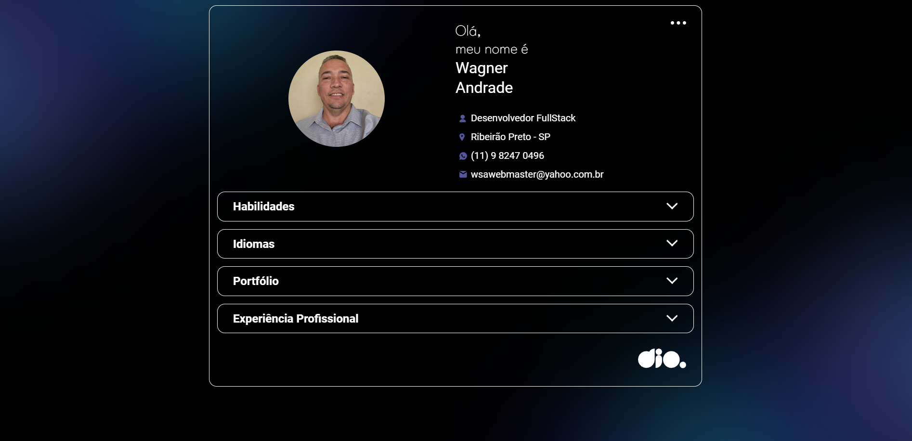

# 📁 Portfólio

📃 Descrição

Projeto de uma página de portfólio aplicando conceitos aprendidos na Formação JavaScript Developer na DIO.

## 🚀 Tecnologias

* `HTML` - Linguagem de marcação para definir a estrutura básica de uma página da Web.
* `CSS` - Linguagem de estilização para criar a aparência visual de uma página da Web.
* `JavaScript` - Linguagem de programação de alto nível para criar interatividade e dinamismo em páginas da web.*

## 💻 Projeto

[Acessar Projeto](https://wsawebmaster.github.io/js-developer-portfolio)

Imagem do Projeto

 # :link: Links úteis
* [Plataforma DIO](https://www.dio.me/)
* [Formação JavaScript Developer](https://web.dio.me/track/formacao-javascript-developer)
* [Meu LinkedIn](https://www.linkedin.com/in/wsawebmaster/)

* [Otimizar Imagem](https://tinypng.com/)
* [Normalize](https://cdnjs.com/libraries/normalize)
* [Calcular PX para REM](https://nekocalc.com/px-to-rem-converter)
